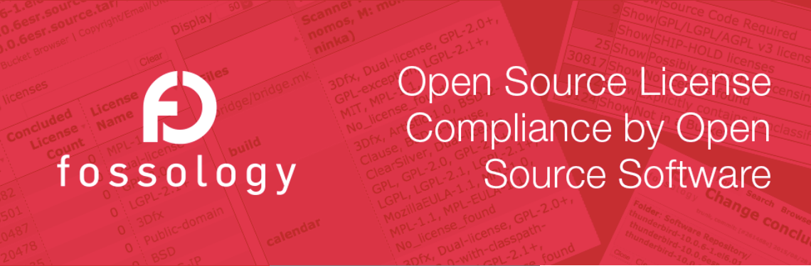

# FOSSology

## 소스 코드 스캔 도구, FOSSology

오픈소스를 사용하고 배포할 때에는 오픈소스 라이선스가 요구하는 의무사항을 준수해야 합니다. 오픈소스를 올바르게 사용하면서 소프트웨어를 개발/배포하는 기업은 이러한 오픈소스 라이선스 의무사항을 준수하기 위한 정책과 프로세스를 갖추고 있습니다. 이러한 라이선스 준수를 위한 일련의 활동을 오픈소스 컴플라이언스라고 합니다. 

오픈소스 컴플라이언스 활동을 위해서는 먼저 제품 소프트웨어에 어떤 오픈소스가 포함되어 있는지 식별해야 하며, 이때 자동화된 소스 코드 스캔 도구를 사용할 수 있습니다. 소스 코드 스캔 도구는 상용 도구 및 오픈소스 도구 등 다양하게 존재합니다. \(참고 : [Source code scanning and license compliance](https://www.linuxfoundation.org/resources/open-source-guides/tools-managing-open-source-programs/#4) \) 각 도구들은 특장점이 있지만 어떤 하나도 모든 문제를 해결할 수 있는 완벽한 기능을 제공하지는 않습니다. 따라서 기업은 제품의 특성과 요구사항에 맞는 적합한 도구를 선택해야 합니다. 

오늘은 이러한 도구 중에서 Linux Foundation의 FOSSology에 대해서 알아보려고 합니다. FOSSology Project \([https://www.fossology.org/](https://www.fossology.org/)\)는 오픈소스로 공개된 소스 코드 스캔 도구로서 기업들이 손쉽게 무료로 사용할 수 있습니다. 

## 주요 특징

FOSSology는 웹 기반의 프로그램으로 사용자는 웹사이트에 로그인하여 개별 파일 혹은 소프트웨어 패키지를 업로드할 수 있습니다. FOSSology는 업로드된 파일 내에 라이선스 텍스트와 Copyright 정보를 검출합니다. 개발자는 사용하고자 하는 오픈소스의 라이선스가 무엇인지, Copyright은 어떻게 되는지에 대한 정보를 확인하고자 할 때 FOSSology를 이용하는 것이 좋습니다. FOSSology는 개발자가 업로드한 오픈소스 패키지 내의 모든 파일을 스캔하여 각 파일 내 라이선스 관련 텍스트와 Copyright 정보를 자동으로 검출하고, 이를 리포트로 생성합니다. FOSSology 주요 특징에 대한 자세한 내용은 다음 페이지를 참고할 수 있습니다. : [https://www.fossology.org/features/](https://www.fossology.org/features/)

## 설치 방법



## Basic Workflow



