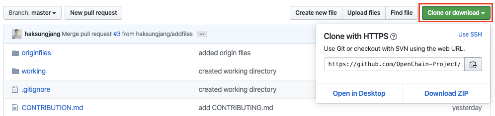

# Pull Request

References

* [https://github.com/kubernetes/community/blob/master/contributors/guide/github-workflow.md](https://github.com/kubernetes/community/blob/master/contributors/guide/github-workflow.md)

## Step 1. Fork

Upstream Repository를 자신의 GitHub 계정으로 [Fork](https://help.github.com/en/github/getting-started-with-github/fork-a-repo)합니다. 

## Step 2. Clone

Fork한 Repository를 자산의 Local working directory로 Clone합니다. 

```text
$ mkdir -p $working_dir
$ cd $working_dir
$ git clone [Fork하여 자신의 GitHub계정에 위치한 Repository의 URL]
```


Repository의 URL은 "clone or download" 버튼을 눌러서 복사할 수 있다. 





